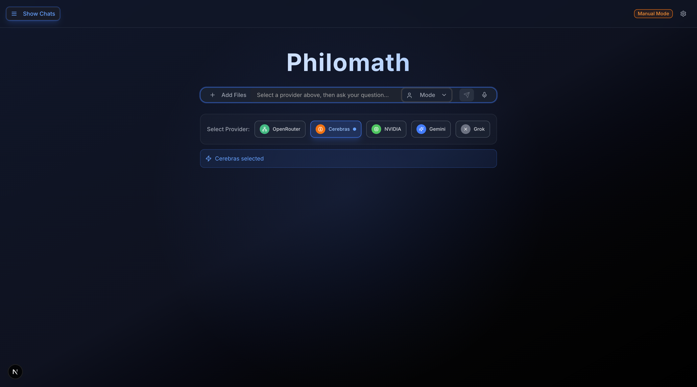
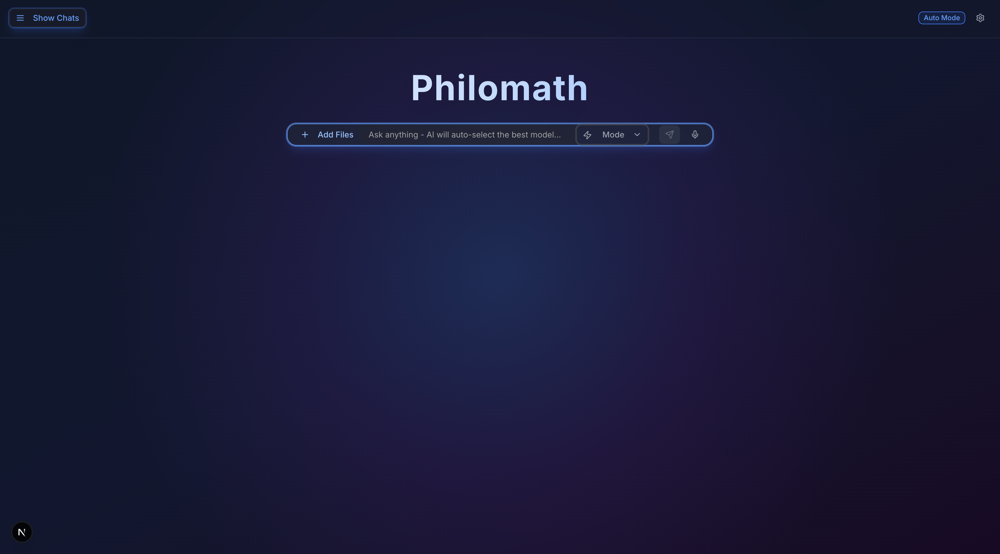
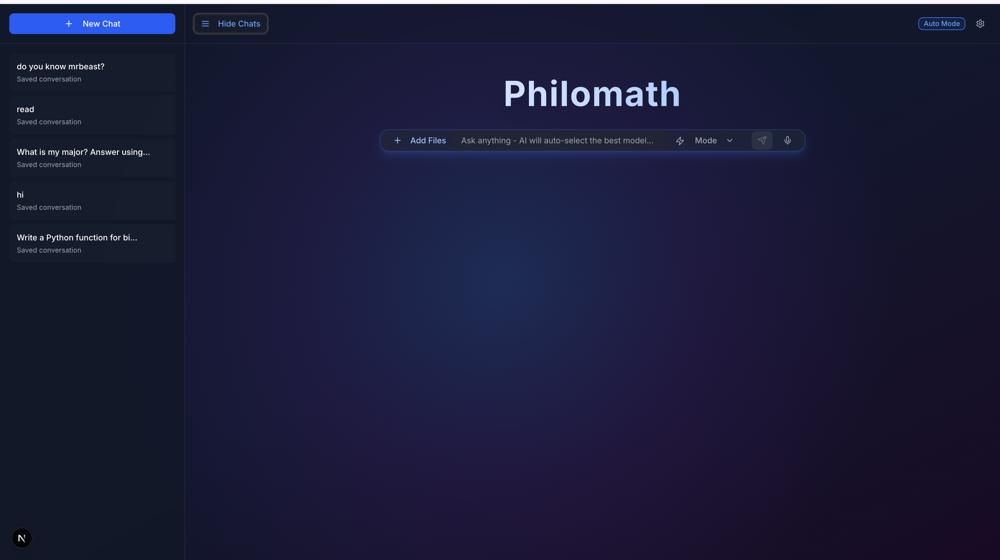

# Philomath

**Philomath** is a full-stack multi-model AI assistant that routes requests to different AI providers based on the type of task being performed.

Instead of relying on a single model, Philomath includes **Basic, Manual, and Auto modes**, persistent conversations, intelligent request routing, and multi-file document understanding.

The project began as a UI prototype during the Build Fellowship and was later rebuilt into a working full-stack application with a React/Next.js frontend, FastAPI backend, Supabase persistence, and multiple AI provider integrations.

---

## Features 

- **Basic Mode** — simple conversational AI
- **Manual Mode** — manually select an AI provider
- **Auto Mode** — Philomath analyzes the request and selects a suitable provider automatically
- **Multi-model routing** using task profiling and capability scoring
- **Multiple AI providers**, including Gemini, Cerebras, NVIDIA, and OpenRouter
- **Persistent conversations** stored through Supabase
- **Conversation history** with saved chat loading and deletion
- **PDF and DOCX document processing**
- **Multiple-file context support**
- **Hidden file context**, allowing the AI to analyze documents without displaying extracted document text in the chat
- **File-related task detection**
- Provider/model metadata displayed with AI responses
- FastAPI REST backend
- Responsive Next.js / React interface

---

## Tech Stack

| Layer | Technologies |
|---|---|
| Frontend | Next.js, React, TypeScript, Tailwind CSS |
| Backend | Python, FastAPI |
| Database | Supabase / PostgreSQL |
| AI Providers | Gemini, Cerebras, NVIDIA, OpenRouter |
| Document Processing | PyPDF, python-docx |
| API Communication | REST / JSON / multipart form data |
| Version Control | Git, GitHub |

---

## How Philomath Works

Philomath separates the user interface, request routing system, AI providers, document processing, and persistent storage into different layers.

```text
                        USER
                          │
                          ▼
                 Next.js / React UI
                          │
                          ▼
                     FastAPI API
                          │
            ┌─────────────┴─────────────┐
            │                           │
            ▼                           ▼
     Philomath Brain              File Processor
            │                     PDF / DOCX
            │                           │
            │                     Extracted Text
            │                           │
            └─────────────┬─────────────┘
                          ▼
                 Request Profiling
                          │
                 Capability Scoring
                          │
                 Provider Selection
                          │
          ┌───────────────┼───────────────┐
          ▼               ▼               ▼
       Gemini          Cerebras         NVIDIA
                          │
                          ▼
                       Response
                          │
                          ▼
                       Supabase
```

---

## Interaction Modes

### Basic Mode

Basic Mode provides normal conversational AI without file uploads or model-selection controls.

### Manual Mode

Manual Mode allows the user to choose which available AI provider should answer the request.

This is useful for comparing model behavior or deliberately selecting a provider for a specific task.

### Auto Mode

Auto Mode uses the **Philomath Brain**.

The backend analyzes the user's request, identifies the likely task category, evaluates available models, and routes the request to an appropriate provider.

Responses can include routing information such as:

```text
Provider: gemini
Model: gemini-2.5-flash
Category: file_related
Confidence: ...
```

---

## Philomath Brain

Auto Mode contains a routing layer rather than simply forwarding every request to one model.

The routing system considers request categories such as:

```text
coding
math
reasoning
creative
research
summarization
long_context
file_related
general
```

Available models are assigned capability, speed, cost, and reliability characteristics.

Philomath then ranks eligible models and selects a provider for the request.

The routing architecture is separated into components for request context, profiling, capability registration, scoring, fallback classification, and final routing.

---

## Multi-File Document Understanding

Philomath supports document context in Manual and Auto modes.

Current supported document types include:

```text
PDF
DOCX
TXT
Markdown
```

The document pipeline works as follows:

```text
Selected Files
      │
      ▼
POST /api/files/upload
      │
      ▼
FastAPI File Processor
      │
      ├── PDF → PyPDF
      ├── DOCX → python-docx
      └── TXT / MD → text decoder
      │
      ▼
Extracted Text
      │
      ▼
Hidden file_context
      │
      ▼
Philomath Brain / Selected Provider
      │
      ▼
AI Response
```

The extracted document text is sent internally as context while the chat interface continues to display only the user's original message.

Philomath can also combine context from multiple documents in a single request.

---

## Conversation Persistence

Philomath uses Supabase to persist conversations and messages.

Users can:

```text
Create conversations
Send messages
Reload previous conversations
Open saved conversations
Delete conversations
View model/provider metadata
```

This allows chat history to survive browser refreshes instead of existing only in frontend state.

---

## Project Structure

```text
Philomath/
│
├── backend/
│   └── app/
│       ├── models/
│       ├── providers/
│       ├── routes/
│       ├── services/
│       │   └── brain/
│       └── main.py
│
├── frontend/
│   ├── app/
│   ├── components/
│   ├── hooks/
│   ├── lib/
│   ├── public/
│   └── styles/
│
├── .gitignore
└── README.md
```

---

## Running Philomath Locally

### Quick Start

From the main Philomath project directory:

```bash
./start.sh

---

## Environment Variables

Philomath requires API credentials for the configured AI providers and Supabase connection.

Secrets are stored locally in environment files and are intentionally excluded from Git through `.gitignore`.

**Never commit API keys or Supabase credentials to the repository.**

---

## Current Status

**Philomath V1**

The current version includes a working frontend/backend architecture, multi-provider AI integration, automatic request routing, Supabase conversation persistence, and multi-file document context processing.

Future versions may expand testing, deployment, authentication, routing evaluation, observability, and additional model capabilities.

---

## Background

Philomath originally began as a multi-AI interface prototype during the **Build Fellowship — From Zero to Prototype**.

The original prototype focused primarily on interaction design and switching between AI systems.

The project was later rebuilt and expanded into the current software-engineering version with:

```text
FastAPI backend
Real provider APIs
Persistent database storage
Routing architecture
Document processing
Multi-file context
Git-based development
```

---
## Screenshots

### Basic Mode


### Manual Mode


### Auto Mode


### Persistent Conversations


---

## Author

**Sujal Jani**  
Computer Science  
Suffolk University — Boston, MA